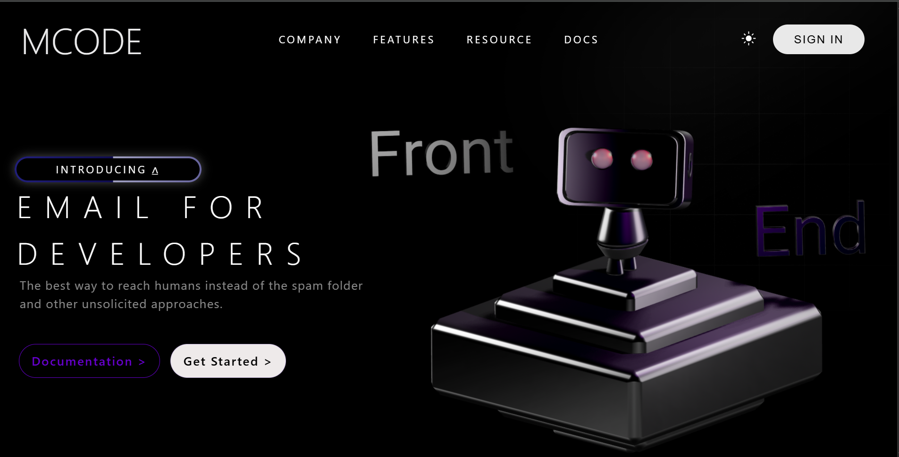

# MCODE 
[CLick here to view site](https://bucolic-blancmange-c04280.netlify.app/#)



First project made with **HTML, CSS, and JavaScript**.  
Built as a playground to learn and experiment with frontend concepts.

## Features
- Responsive design with Dark/Light mode  
- 3D modal that follows the cursor  
- Sign In / Sign Up form  
- Smooth animations and transitions  

## Getting Started
1. Clone the repo:
   ```bash
   git clone https://github.com/Kamiz660/MCODE.git
